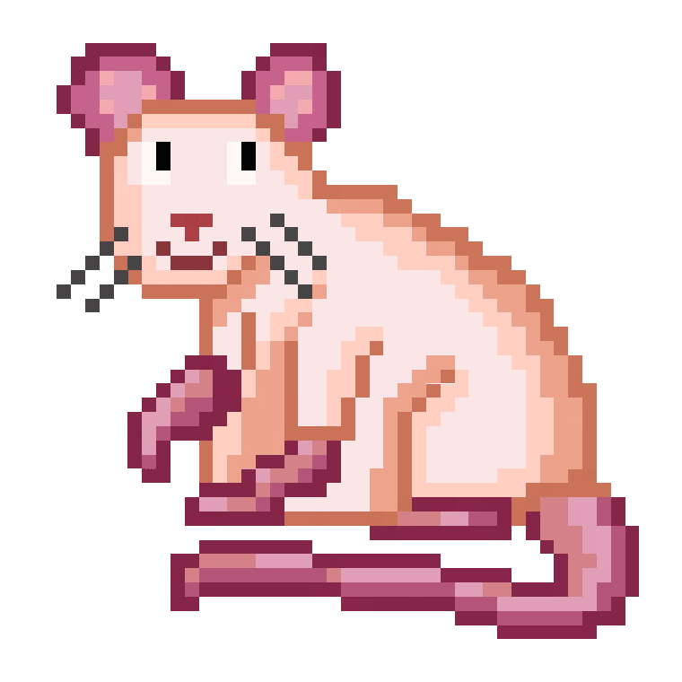
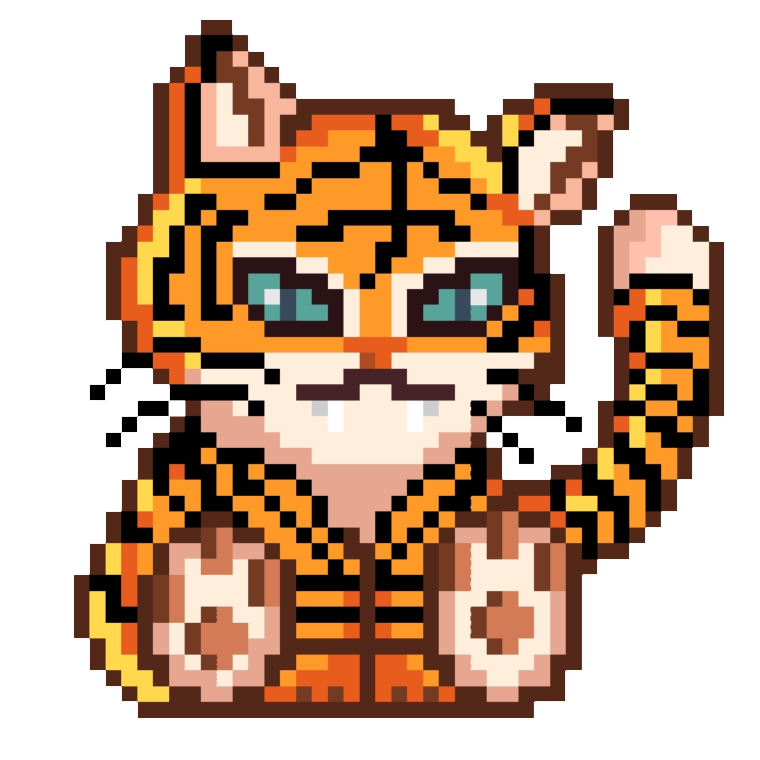
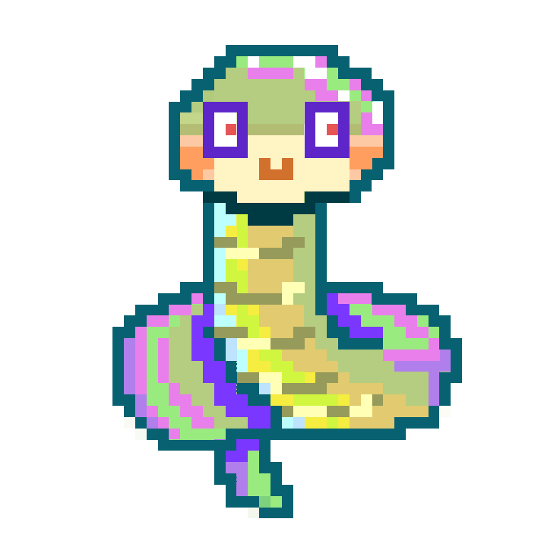
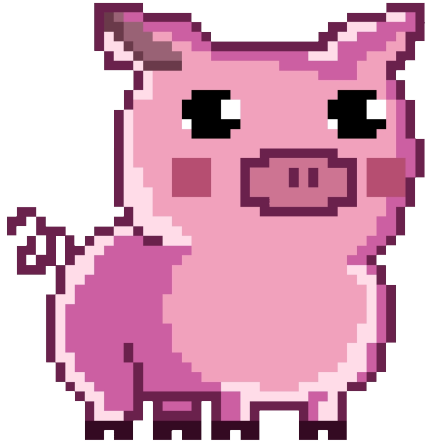
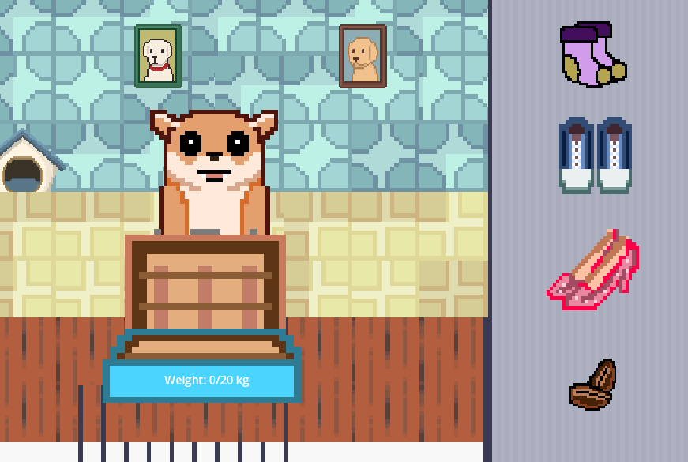

# 🎨 2D Game Art Portfolio

A showcase of my 2D game art, character designs, assets, and game development work created for my projects in Godot.

---

## 🥠 Fortune Trails

**Fortune Trails** is a 2D zodiac-based game I created for a university club fair. I designed the game's characters, UI, environments, and visual assets.

### 🐲 Zodiac Character Designs

A collection of Chinese zodiac characters created for Fortune Trails.

| | | |
|---|---|---|
|  |  |  |
| **Rat** | **Ox** | **Tiger** |
|  |  |  |
| **Rabbit** | **Dragon** | **Snake** |
|  |  |  |
| **Horse** | **Goat** | **Monkey** |
|  |  |  |
| **Rooster** | **Dog** | **Pig** |

### 🎮 Another game

### 🛠️ Tools

- Godot
- GDScript
- 2D Digital Art
- Character Design
- Game UI Design
- Game Asset Creation

---

## 🌱 More Projects Coming Soon

This portfolio will continue to grow with characters, environments, UI designs, animations, and assets from my 2D game projects.
